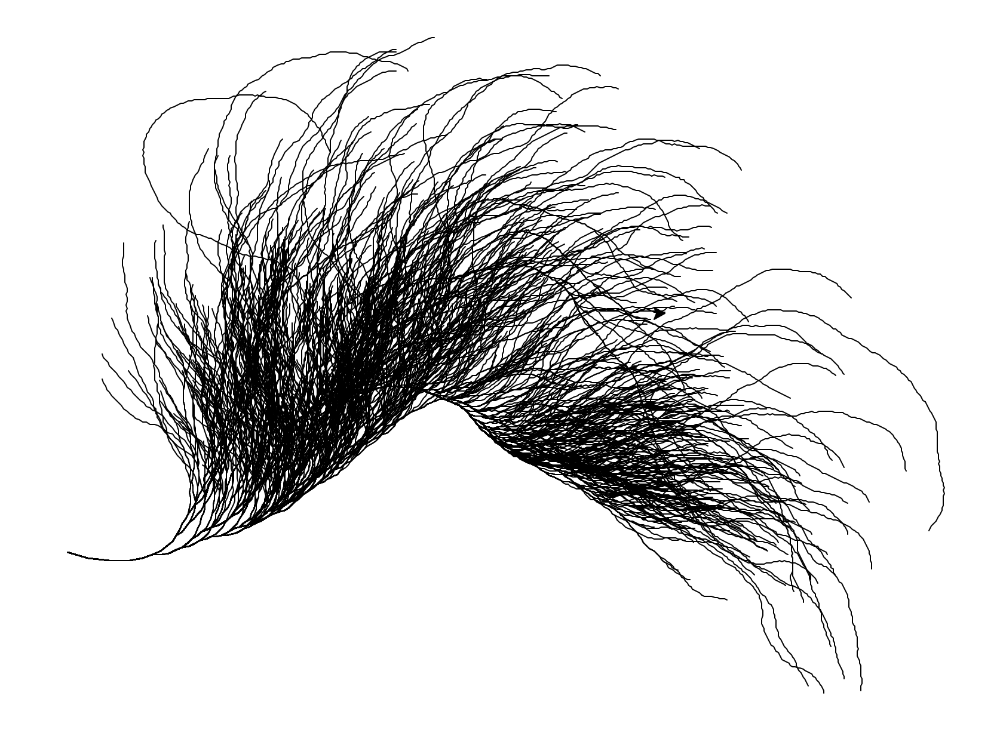
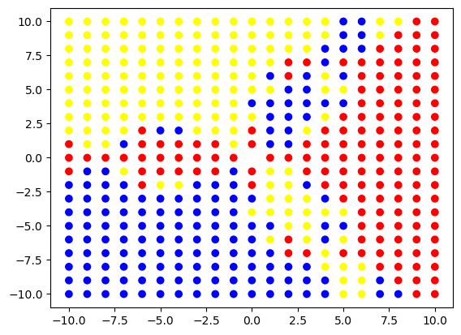

# Jupyter Notebooks

This repository contains 12 Jupyter notebooks exploring various computational and data visualisation problems.
I’ve started with simpler examples I had on my computer and plan to gradually increase their complexity and depth.

### Collatz Conjecture Paths
I first came across this conjecture through Project Euler (Problem 14), which asks:

“Which starting number under one million produces the longest Collatz sequence?”

It was the first time I applied memoization to reduce computation time from about 14 seconds to under 2. Although the function in this notebook doesn’t use memoization (since only 5,000 sequences are computed), the concept was a valuable learning point.

I was inspired by a Numberphile video showing a visualisation of Collatz paths.
My first attempt used Python’s turtle module, but since turtle only allows lines ≥ 1 px wide, I switched to Matplotlib with NumPy, allowing me to render thinner 0.3 px lines and a more detailed visual.

Turtle result (1000 paths):

Matplotlib result: https://github.com/Michalous/jnb/blob/main/collatz_conjecture.ipynb

### Newton Fractals
$$
\quad x_{n+1} = x_n - \frac{f(x_n)}{f'(x_n)}\quad
$$

I have been familiar with the Newton–Raphson method for some time. It can, for instance, be used to compute square roots and typically converges much faster than the bisection method.

When I developed the Zoomable Mandelbrot Set project, I was inspired to create something similar using Newton’s method. Both approaches involve evaluating convergence and divergence across the complex plane, however in this case the process requires a polynomial, its derivative, and its roots.

I initially tested the algorithm on a 20 × 20 grid, producing the result shown below:

This first version used only three colors, but it confirmed that the idea worked. The upgraded version uses an 800 × 800 grid and 20 shades per color, where each shade represents the number of iterations required for a point to converge to a particular root. 