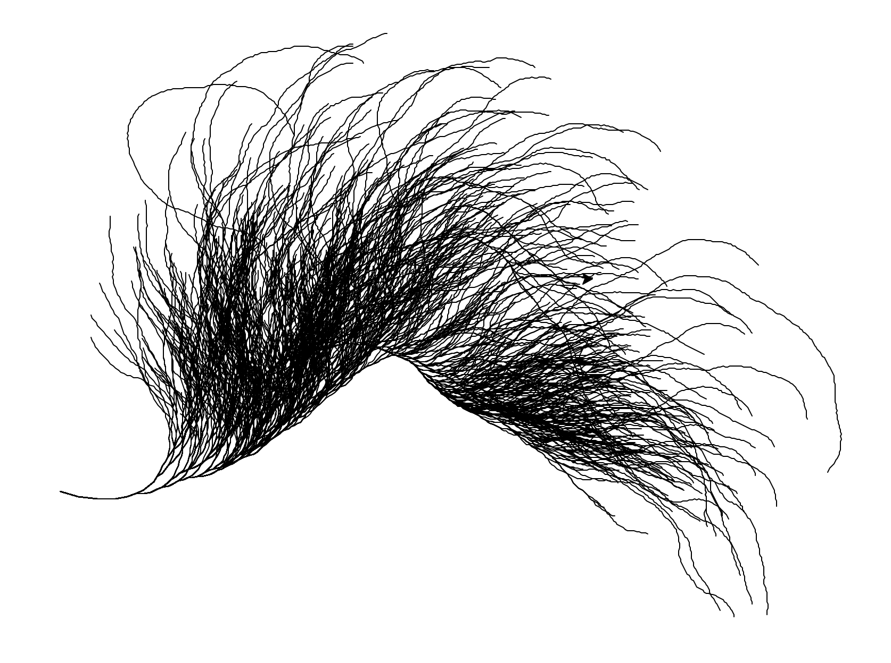
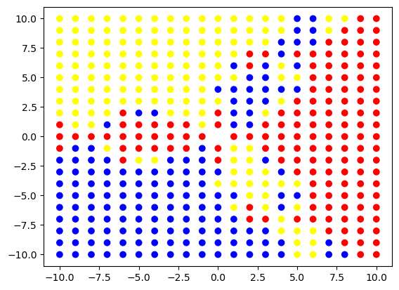
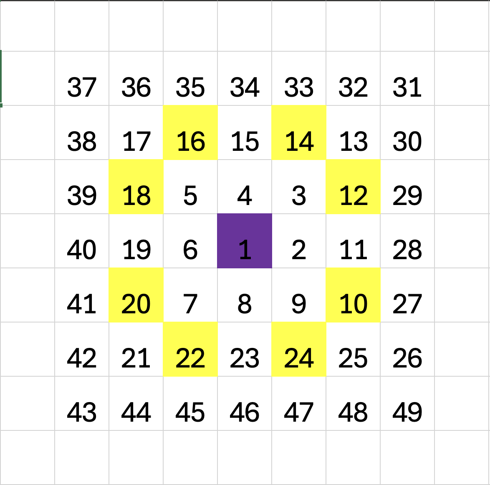
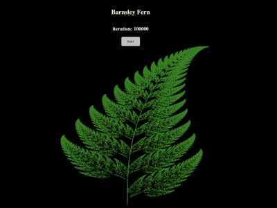
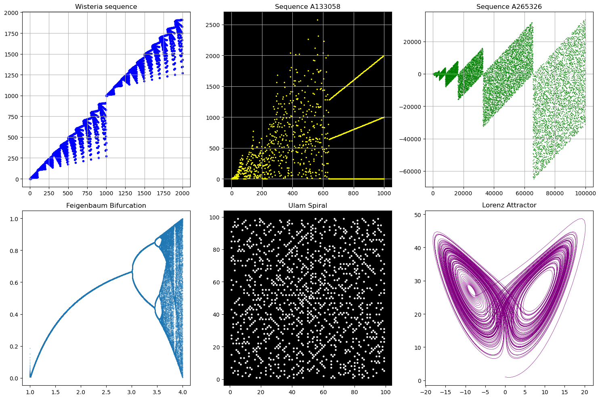
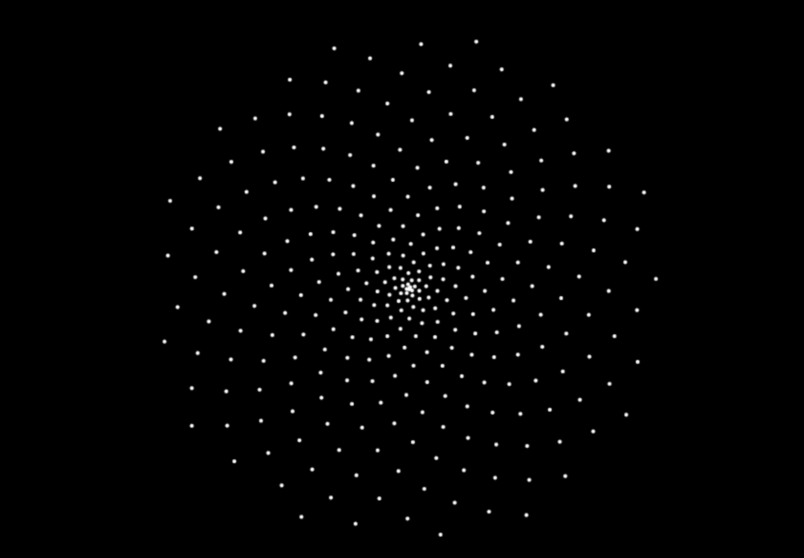

# Jupyter Notebooks

This repository contains half a dozen Jupyter notebooks exploring various computational and data visualisation problems.
I’ve started with simpler examples I had on my computer and plan to gradually increase their complexity and depth.

It's part of my portfolio website: https://www.chronoson.co.uk

### Collatz Conjecture Paths
I first came across this conjecture through Project Euler (Problem 14), which asks:

“Which starting number under one million produces the longest Collatz sequence?”

It was the first time I applied memoization to reduce computation time from about 14 seconds to under 2. Although the function in this notebook doesn’t use memoization (since only 5,000 sequences are computed), the concept was a valuable learning point.

I was inspired by a Numberphile video showing a visualisation of Collatz paths.
My first attempt used Python’s turtle module, but since turtle only allows lines ≥ 1 px wide, I switched to Matplotlib with NumPy, allowing me to render thinner 0.3 px lines and a more detailed visual.

Turtle result (1000 paths):

Matplotlib result: https://github.com/Michalous/jnb/blob/main/collatz_conjecture.ipynb

### Newton Fractals
$$
\quad x_{n+1} = x_n - \frac{f(x_n)}{f'(x_n)}\quad
$$

I have been familiar with the Newton–Raphson method for some time. It can, for instance, be used to compute square roots and typically converges much faster than the bisection method.

When I developed the Zoomable Mandelbrot Set project, I was inspired to create something similar using Newton’s method. Both approaches involve evaluating convergence and divergence across the complex plane, however in this case the process requires a polynomial, its derivative, and its roots.

I initially tested the algorithm on a 20 × 20 grid, producing the result shown below:

This first version used only three colors, but it confirmed that the idea worked. The upgraded version uses an 800 × 800 grid and 20 shades per color, where each shade represents the number of iterations required for a point to converge to a particular root. 

Find it here: https://github.com/Michalous/jnb/blob/main/newton_raphson.ipynb

### The Trapped Knight
I learned about this problem through another Numberphile video, which demonstrated how a chess knight behaves when constrained to always move to the lowest-numbered unvisited square on an infinite spiral-numbered grid.

The concept is simple: starting from the center (square 1), the knight evaluates its eight possible moves and chooses the one with the smallest number. That square is then marked as visited, and the process repeats. Eventually, after a finite number of moves, the knight becomes "trapped" - all possible moves lead to previously visited squares.

The result shows the knight's path over 2016 moves, with color coding representing different phases of the journey.

You can find the path here: https://github.com/Michalous/jnb/blob/main/trapped_knight.ipynb

### Chaos Game
I found out about the Chaos Game through James Gleick's book "Chaos: Making a New Science." I had previously implemented the classic triangle version in JavaScript along with the Sierpinski carpet and Barnsley fern.
This can be found here: https://michalous.github.io/sierpinski

The Chaos Game is a simple algorithm that generates fractal patterns through iterative rules. Starting from a random point, you repeatedly choose a random vertex of a shape and move halfway toward it, plotting each new point. Over many iterations, this creates self-similar fractal structures that fill the space between the original vertices.

For this implementation, I chose a regular pentagon. I initially experimented with different iteration counts and starting positions to understand how the pattern emerges.

The final version generates 120,000 points, revealing the intricate fractal that develops between the pentagon's vertices.

This project demonstrates how deterministic rules applied randomly can produce complex patterns. 

You can have a look at it here: https://github.com/Michalous/jnb/blob/main/chaos_game.ipynb

### Sequences

I became fascinated with the Online Encyclopedia of Integer Sequences (OEIS) as an endless source of mathematical patterns and relationships. This notebook shows three different sequences through visualization.

I also included the Ulam spiral, reusing the number spiral foundation from my earlier work. This visualization reveals hidden patterns in prime numbers, with primes appearing to cluster along diagonal lines.

I've concluded with Feigeinbaum bifurcation diagram and Lorenz attractor which can both be found in "Chaos" book by James Glieck.

The notebook demonstrates different approaches to sequence visualization, from scatter plots to spiral arrangements, and shows how mathematical abstraction can produce visually striking results.

You can explore these sequence visualizations here: https://github.com/Michalous/jnb/blob/main/sequences.ipynb

### Golden Ratio
I saw the golden ratio animation through another Numberphile video, which explored how this mathematical constant (φ ≈ 1.618) governs patterns in nature, particularly the arrangement of seeds in sunflowers.

I created a simulation showing how sunflower seeds grow using the golden angle. The golden angle (approximately 137.5°) is special because it allows for optimal packing as the flower head expands.

My implementation places seeds sequentially along interlocking spirals, starting from the center and working outward. I also created an interactive animation that shows the growth process in real-time.

You can see the interactive animation here: https://michalous.github.io/golden-ratio

Find the full implementation here: https://github.com/Michalous/jnb/blob/main/golden_ratio.ipynb